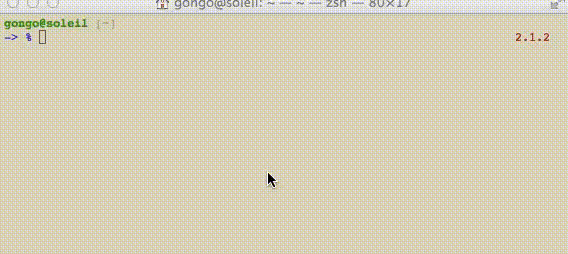
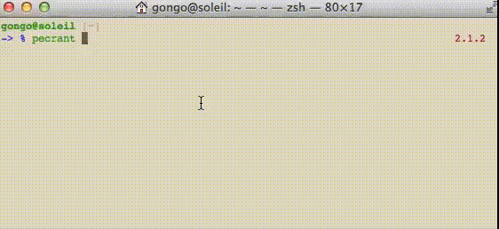

pecrant
==========

[](https://travis-ci.org/gongo/pecrant)

Vagrant `global-status` controller for peco.

Requirements
--------------------

- [peco](https://github.com/peco/peco)
- [Vagrant 1.6 or higher](http://www.vagrantup.com/blog/feature-preview-vagrant-1-6-global-status.html)
    - Using `vagrant global-status`

Getting started
--------------------

### Installation

```
$ cd /path/to/bin # in $PATH
$ curl -O https://raw.githubusercontent.com/gongo/pecrant/master/pecrant
$ chmod +x ./pecrant
```

### Usage

```
$ pecrant help
Usage: pecrant <command>

  up        Start the selected vagrant machine
  provision Provision the selected vagrant machine
  reload    Restart the selected vagrant machine
  suspend   Suspend the selected vagrant machine
  resume    Resume the selected vagrant machine
  halt      Stop the selected vagrant machine
  destroy   Stop and delete all traces of the vagrant machine
  ssh       Connect to machine via SSH
  dir       Show directory path for vagrant environments
  list      Show vagrant environments for this user
  help      Show this message
```

`$ pecrant up`:



`$ pecrant halt`:


#### Advance

Support `Select Multiple Lines`:



Alternative of `pecrant cd`

    $ cd "$(pecrant dir)"

License
--------------------

MIT License.
